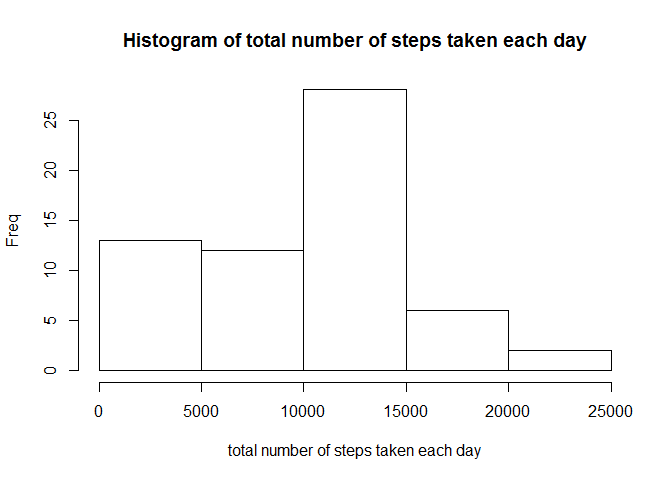
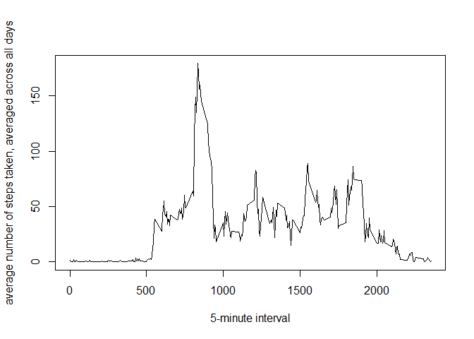
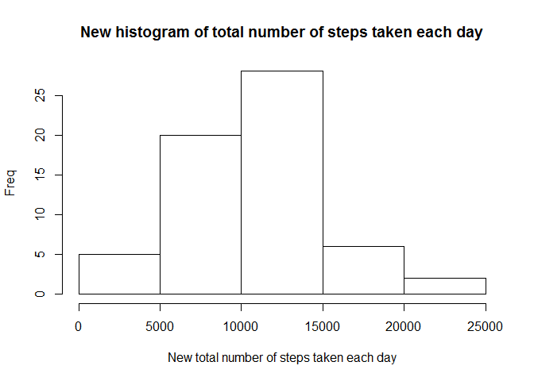
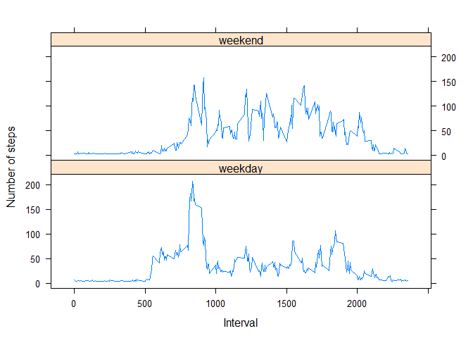

# Reproducible Research: Peer Assessment 1

## Loading and preprocessing the data


```r
unzip(zipfile="activity.zip")

data <- read.csv('activity.csv', stringsAsFactors=F)

data[,2] <- as.Date(data[,2],format='%Y-%m-%d',origin='1970-01-01') ##convert the date field to Date class

no.of.intervals.per.day <- 24*60/5

no.of.days <- nrow(data)/no.of.intervals.per.day 
```

## What is mean total number of steps taken per day?


```r
data1<-data
data1[is.na(data1)] <- 0 ##turning NAs to zero to faciliate easy calculation

total.per.day <- c()
x<-c(1:no.of.intervals.per.day)

for (i in 1:no.of.days)
{
      total.per.day[i] <- sum(data1[x,1])
      x <- x+no.of.intervals.per.day
}

hist(total.per.day,xlab = "total number of steps taken each day", ylab = "Freq",main='Histogram of total number of steps taken each day')
```

 

```r
mean.per.day <- mean(total.per.day)
median.per.day <- median(total.per.day)

print(paste('The mean total number of steps taken per day is',mean.per.day))
```

```
## [1] "The mean total number of steps taken per day is 9354.22950819672"
```

```r
print(paste('The median total number of steps taken per day is',median.per.day))
```

```
## [1] "The median total number of steps taken per day is 10395"
```

## What is the average daily activity pattern?


```r
y<- seq(1, nrow(data1) , by=no.of.intervals.per.day)
avg.no.of.steps <- c()

for (i in 1:no.of.intervals.per.day)
{
      avg.no.of.steps[i]<- mean(data1[y,1])
      y <- y+1
}

plot(x=data1[c(1:no.of.intervals.per.day),3],y=avg.no.of.steps,xlab='5-minute interval',ylab='average number of steps taken, averaged across all days',type = 'l')
```

 

```r
a<-which.max(avg.no.of.steps)

min1<-data1[c(1:no.of.intervals.per.day),3][a]
min2<-min1+5

print(paste('The ',a,'th',' 5-minute interval from the ',min1,'th minute to ',min2,'th minute has maximum number of steps of ',max(avg.no.of.steps),sep=""))
```

```
## [1] "The 104th 5-minute interval from the 835th minute to 840th minute has maximum number of steps of 179.131147540984"
```

## Imputing missing values


```r
sum(is.na(data[,1]))
```

```
## [1] 2304
```

```r
data2<-data
data2[is.na(data2)] <- mean.per.day/no.of.intervals.per.day ##Here we use mean to replace the missing values
```

Note that we use mean to replace the missing values


```r
new.total.per.day <- c()
x<-c(1:no.of.intervals.per.day)

for (i in 1:no.of.days)
{
      new.total.per.day[i] <- sum(data2[x,1])
      x <- x+no.of.intervals.per.day
}

hist(new.total.per.day, xlab = "New total number of steps taken each day", ylab = "Freq",main='New histogram of total number of steps taken each day')
```

 

```r
new.mean.per.day <- mean(new.total.per.day)
new.median.per.day <- median(new.total.per.day)

print(paste('The new mean total number of steps taken per day is',new.mean.per.day))
```

```
## [1] "The new mean total number of steps taken per day is 10581.013705993"
```

```r
print(paste('The new median total number of steps taken per day is',new.median.per.day))
```

```
## [1] "The new median total number of steps taken per day is 10395"
```

The median remains unchanged while the new mean is now closer to the median, making the distribution less skewed.

## Are there differences in activity patterns between weekdays and weekends?

### Splitting the data into 2 factors, weekday and weekend ###


```r
wkend<-c('Saturday','Sunday')
wkend.data2<-data2[1,]
wkday.data2<-data2[1,]

for (i in 1:nrow(data2))
{
      if ( is.element( weekdays(data2[i,2]),wkend ) ) 
      {
            wkend.data2<-rbind(wkend.data2,data2[i,])
      }
      else
      {
            wkday.data2<-rbind(wkday.data2,data2[i,])
      }
}

wkend.data2<-wkend.data2[-1,]
wkday.data2<-wkday.data2[-1,]

####Weekend####

y<- seq(1, nrow(wkend.data2) , by=no.of.intervals.per.day)
avg.no.of.steps.wkend <- c()

for (i in 1:no.of.intervals.per.day)
{
      avg.no.of.steps.wkend[i]<- mean(wkend.data2[y,1])
      y <- y+1
}

####Weekday####

y<- seq(1, nrow(wkday.data2) , by=no.of.intervals.per.day)
avg.no.of.steps.wkday <- c()

for (i in 1:no.of.intervals.per.day)
{
      avg.no.of.steps.wkday[i]<- mean(wkday.data2[y,1])
      y <- y+1
}
```

### Make a panel plot ###


```r
library(lattice)

day=c(rep("weekend",times=length(avg.no.of.steps.wkend)),rep("weekday",times=length(avg.no.of.steps.wkday)))
day<-as.factor(day)

data3<-data.frame( steps=c(avg.no.of.steps.wkend,avg.no.of.steps.wkday) , interval=c(data2[c(1:no.of.intervals.per.day),3],data2[c(1:no.of.intervals.per.day),3]) , day=day)

data3[,3]<-as.factor(data3[,3])

xyplot(data3[,1] ~ data3[,2] | data3[,3] , data = data3, layout=c(1,2), type = 'l',xlab = "Interval", ylab = "Number of steps")
```

 


